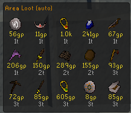
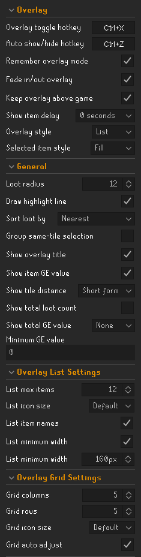
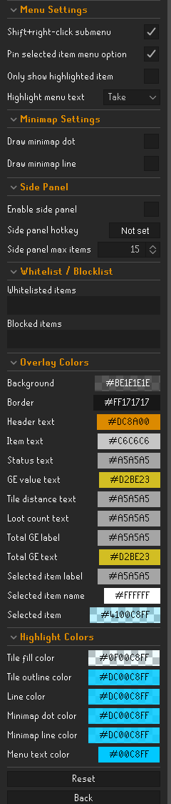

# Area Loot

Area Loot is a RuneLite plugin for quickly finding ground items near your player. It adds an RS3-style nearby loot list and lets you click an item to highlight its exact tile in the game world.

<table>
  <tr>
    <td valign="top"><strong>List overlay</strong></td>
    <td width="24" bgcolor="#000000">&nbsp;</td>
    <td valign="top"><strong>Grid overlay</strong></td>
  </tr>
  <tr>
    <td valign="top"></td>
    <td width="24" bgcolor="#000000">&nbsp;</td>
    <td valign="top"></td>
  </tr>
</table>

 

## Features

### Overlay and panel

- Nearby ground-loot shown in a movable list or icon-grid overlay.
- Optional RuneLite side panel with the same nearby loot list.
- Configurable hotkeys for the overlay, auto show/hide overlay, and side panel.
- Optional overlay mode persistence across logout/login.
- Auto show/hide mode that displays the overlay only when nearby loot is available.

### Display options

- Configurable item icons, item names, and icon size in list mode.
- GE value display with configurable value and distance text colors.
- Configurable tile distance display: none, short form, or long form.
- Optional footer indicators for visible loot count and total visible GE value.
- Configurable overlay style, size, position, colors, fade animation, and side-panel visibility.
- Configurable grid size, icon size, and optional auto-adjust for the icon-grid overlay.

### Filtering and sorting

- Sort by nearest item or highest GE value.
- Hide low-value drops with a minimum GE value filter.
- Whitelist or block specific items by exact name, including wildcard patterns.
- Exact list entries only match that item, such as `Rune sword`.
- Wildcard entries use `*`, such as `Rune *`, `* sword`, or `Burnt *`.
- Optional Shift right-click menu option to add, remove, whitelist, or block ground items, with a short chat message confirming the exact item name.
- Optional right-click menu filtering so only the highlighted item is shown on crowded loot piles.
- Optional selected-item right-click menu pinning for the Take option and Examine grouping.

### Highlighting

- Click an item to highlight its ground tile; click it again to clear the highlight.
- Configurable selected-item overlay style: fill or outline.
- Optional selected-item right-click menu text highlighting with configurable scope and color.
- Optional line from your player to the highlighted item.

 

## Configurations

<table>
  <tr>
    <td valign="top"><strong>Overlay settings</strong></td>
    <td width="24" bgcolor="#000000">&nbsp;</td>
    <td valign="top"><strong>Menus and configuration settings</strong></td>
  </tr>
  <tr>
    <td valign="top"></td>
    <td width="24" bgcolor="#000000">&nbsp;</td>
    <td valign="top"></td>
  </tr>
</table>

## Change log

 Click to view the <a href="https://github.com/Aiirik/AreaLoot/blob/master/CHANGELOG.md">CHANGELOG</a>
