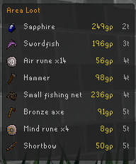

# Area Loot

Area Loot is a RuneLite plugin for quickly finding ground items near your player. It adds an RS3-style nearby loot list and lets you click an item to highlight its exact tile in the game world.

## Features

- Nearby ground-loot shown in a movable list or icon-grid overlay.
- Optional RuneLite side panel with the same nearby loot list.
- Configurable hotkeys for the overlay, auto show/hide overlay, and side panel.
- Optional overlay mode persistence across logout/login.
- Auto show/hide mode that displays the overlay only when nearby loot is available.
- Item icons in both the overlay and side panel.
- GE value display with configurable value and distance text colors.
- Sort by nearest item or highest GE value.
- Hide low-value drops with a minimum GE value filter.
- Block specific items by name, including wildcard patterns like `Burnt *`.
- Optional Shift right-click menu option to add or remove ground items from the blocked item list.
- Configurable grid size for the icon-grid overlay.
- Configurable tile distance display: none, short form, or long form.
- Click an item to highlight its ground tile; click it again to clear the highlight.
- Optional line from your player to the highlighted item.
- Configurable overlay style, size, position, colors, fade animation, and side-panel visibility.
- Optional right-click menu filtering so only the highlighted item is shown on crowded loot piles.
